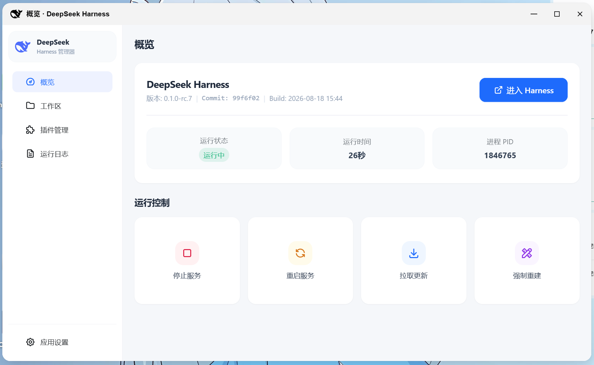
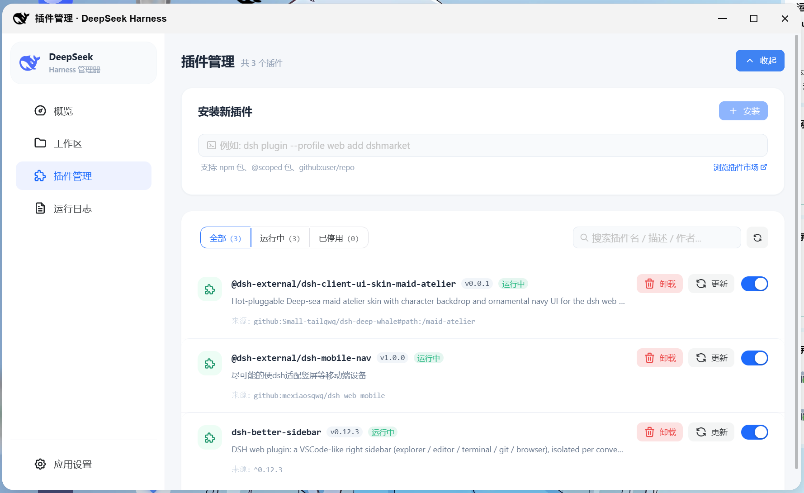

# DeepSeek Harness for fnOS

专为飞牛 fnOS 打造的 DeepSeek Harness 一键部署与可视化管理应用。

---

## 主要功能

- **服务控制**：支持启动、停止、重启、拉取更新与强制重建，内置进程组清理。
- **插件管理**：支持命令安装（npm 包 / GitHub 仓库）、构建脚本自动放行（allowBuilds）、一键启停与卸载。
- **工作区查看**：实时同步工作区列表、关联会话数及更新时间，支持在文件管理中一键定位目录。
- **安全与网关**：支持飞牛统一网关、单端口 HTTP/HTTPS 自适应反代与外部自定义地址，提供访问密码鉴权（技术实现详见 [反代适配文档](./REVERSE_PROXY_ADAPTATION.md)）。
- **运行日志**：WebSocket 实时推送日志，支持语法高亮、自动滚动、日志轮转、清空与下载。
- **应用设置**：支持配置服务端口、反向代理端口、打开方式、访问密码及网络代理，端口占用检测与热重载。

---

## 预览




## B站视频(求三连！)

[](https://www.bilibili.com/video/BV1bbbe6pEYE)

---

## 技术架构

- **后端**：Go 1.23 + Gin Web 框架 + Gorilla WebSocket + Linux 进程管理
- **前端**：Vue 3 + TypeScript + Naive UI + Pinia + Tailwind CSS + Vite
- **打包规范**：飞牛 fnOS 原生应用包规范（`fnpack`）

---

## 项目结构

```
deepseek.harness/
├── harness.go          # 服务生命周期管理与状态机
├── process.go          # 进程组控制、孤儿清理、端口等待与巡检自愈
├── build.go            # 源码拉取(Git/Zip)、GCC/Musl环境准备与构建
├── plugins.go          # 插件解析、安装、启停与安全校验
├── profile.go          # 插件运行时补丁与构建策略管理 (cordis.patch.yml / allowBuilds)
├── workspace.go        # 工作区数据提取与文件监控
├── proxy.go            # 内置反向代理服务与访问认证
├── fngateway.go        # 飞牛网关直连反代与状态感知
├── api.go              # RESTful API 与 WebSocket 实时通道
├── config.go           # 应用配置持久化与全局运行环境变量
├── logger.go           # 运行日志记录、轮转与增量订阅
├── main.go             # 程序入口与 Unix Socket 监听
├── REVERSE_PROXY_ADAPTATION.md # 反向代理与网关子路径适配技术文档
├── templates/          # 独立内嵌页面模板 (//go:embed)
│   ├── auth_login.html     # 访问密码验证页面
│   └── gateway_status.html # 网关状态与错误引导页面
├── fnpack/             # 飞牛 OS 应用包配置与生命周期脚本
│   ├── manifest        # 应用元数据清单
│   ├── config/         # 权限与资源配置
│   └── cmd/            # 安装、启动、停止与卸载脚本
└── frontend/           # Naive UI 前端项目
    ├── src/
    │   ├── api/        # 统一 API 接口服务
    │   ├── mock/       # 本地离线开发仿真插件 (Vite)
    │   ├── stores/     # Pinia 模块化状态管理
    │   ├── utils/      # HTTP 客户端与 WebSocket 管理器
    │   ├── types/      # TypeScript 契约与类型定义
    │   ├── views/      # 概览、工作区、插件、日志、设置视图
    │   └── theme.ts    # 主题定制
    └── package.json
```

---

## 构建与打包

### 1. 前端构建
```bash
cd frontend
npm install
npm run build
cd ..
```

### 2. 后端编译（针对 Linux amd64）
```bash
set GOOS=linux
set GOARCH=amd64
go build -ldflags "-s -w" -o fnpack/app/bin/deepseek.harness .
```

### 3. 生成飞牛 fnOS 安装包
在项目根目录下执行 `build.cmd` 或 `build.sh` 即可生成 `.fpk` 安装包。
